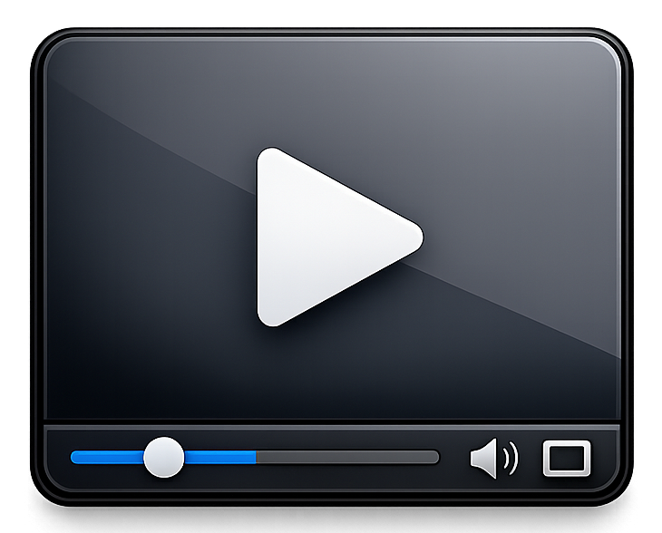

# Gmpv

a simple video player for GNOME, powered by mpv.



## what it does

plays videos. uses mpv under the hood so it handles pretty much everything you throw at it. the UI is native GTK4/libadwaita so it fits right into your GNOME desktop.

## features

- drag and drop files to play
- keyboard shortcuts (space to pause, arrows to seek, f for fullscreen, m to mute, q to quit)
- subtitle and audio track switching
- volume control
- double click to fullscreen
- right click context menu
- auto hiding controls

## dependencies

- python 3.11+
- gtk4
- libadwaita
- mpv
- python-mpv
- PyGObject

on arch:

```
sudo pacman -S gtk4 libadwaita mpv python-gobject
pip install python-mpv
```

## install

```
meson setup builddir --prefix=/usr
sudo meson install -C builddir
```

## run without installing

```
./gmpv
```

## license

GPL 2.0
